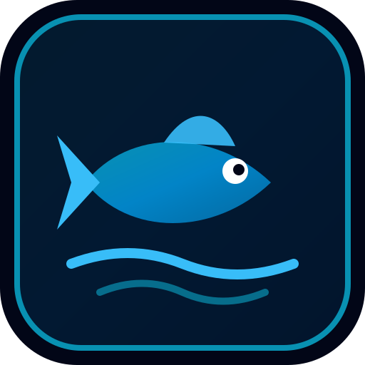

# ?? AquaForge ? Aquatic Farm & Breeding Management System



**AquaForge** is a modern, practical aquatic farm and selective breeding management system designed for breeders and hobbyists keeping and raising:
- **Guppies** (*Poecilia reticulata*)
- **Mollies** (*Poecilia sphenops*)
- **Flowerhorns** (*Cichlasoma sp.*)
- **Australian Redclaw / Dwarf Crayfish** (*Cherax quadricarinatus* / *Cambarellus*)

Built with **Laravel 12**, **MySQL / SQLite**, **Tailwind CSS**, **Alpine.js**, **Chart.js**, and **Simple-QRCode**. AquaForge also functions as an installable **Progressive Web App (PWA)** with an integrated **In-Browser Camera QR Code Scanner** for daily fishroom operations.

---

## ? Key Features

### 1. Farm & Aquarium Setups (Tank Hub)
- **Interactive Dimension Calculator**: Calculate exact water volume in Liters and Gallons from dimensions $(L 	imes W 	imes H / 1000)$. Includes presets for 45cm, 2ft, 3ft, and breeding tubs.
- **Automatic QR Code Generation**: Every tank setup immediately gets an SVG QR code tag.
- **Printable Sticker Tags**: Dedicated print layouts (Single 4"x2.5", Compact 3"x2", and 4-Tag Sheets) formatted for thermal sticker printers or tank glass labels.
- **In-Browser Camera QR Scanner**: Point your phone camera at any tank sticker to instantly open its feeding, water testing, and maintenance action hub.

### 2. Selective Livestock Registry
- **Photo Uploads**: High-resolution fish cataloging.
- **1?5 Trait Scoring Matrix**: Body, Color, Tail/Fin, Dorsal/Spread, Pattern, and Overall grade.
- **Quality Tiers**: Automatic classification into `SHOW`, `BREEDER`, `MATERIAL`, or `CULL`.
- **Relocation History**: Track movements across aquariums and grow-out tubs.

### 3. Breeding & Fry Cohort Tracking
- **Breeding Pair Manager**: Pair Dam (?) and Sire (?) with spawning tank assignment, expected hatch dates, and status tracking.
- **Offspring Batch Cohorts**: Track fry populations without individual fish overhead.
- **Mortality & Culling Audits**: Log losses and selective culling with strict validation preventing negative populations.

### 4. Daily Husbandry & Water Chemistry Engine
- **Water Chemistry Logger**: Track Temperature (?C), pH, Ammonia ($NH_3$), Nitrite ($NO_2$), Nitrate ($NO_3$), and TDS (ppm).
- **Rule-Based Condition Engine**: Automatic classification into `GOOD`, `WARNING`, or `CHECK` parameters with visual alerts.
- **Dietary Feeding Log**: Quick presets (Live BBS, High-Protein Pellets, Bloodworms, Microworms, Spirulina, Crayfish Pellets).
- **Aquarium Maintenance**: Calculate water change percentages, record filter cleanings, and log chemical dosing.

### 5. Business Operations & Philippine Economics (?)
- **Supplies & Inventory**: Track feed, medication, test kits, and packaging with automatic `LOW STOCK` threshold alerts.
- **Customer Directory**: Buyer contacts, shipping addresses, notes, and lifetime spend history.
- **Interactive Invoicing & Sales Builder**:
  - Selecting adult fish automatically marks them as `SOLD`.
  - Selecting fry cohorts automatically decrements available batch population (and sets status to `SOLD_OUT` when depleted).
  - Real-time calculations with line subtotals, custom discounts, and final payable totals in **Philippine Peso (?)**.
- **Printable Customer Invoices**: Clean, printable sales receipts with farm branding and live-arrival guarantee policy.
- **Farm Expense Tracking**: Categorize operational costs (feed, electricity, utilities, livestock acquisitions, gear).
- **Reports & Economics**: Lifetime and monthly financial overviews:
  $$	ext{Revenue} - 	ext{Expenses} = 	ext{Net Operating Result}$$

---

## ??? Technology Stack

- **Backend**: PHP 8.3+, Laravel 12, Eloquent ORM
- **Database**: MySQL 8.0+ (Production) / SQLite (Local/Testing)
- **Frontend**: Blade Components, Tailwind CSS, Alpine.js, Lucide Icons, Chart.js
- **PWA**: Web App Manifest (`manifest.json`), Service Worker (`sw.js`), Maskable Icons
- **QR Operations**: Simple-QRCode (Backend SVG generator) + `html5-qrcode` (In-Browser Camera Scanner)
- **Testing**: PHPUnit / Pest Feature Test Suite (54 passing feature tests)

---

## ?? Installation & Local Setup

### 1. Clone the Repository
```bash
git clone https://github.com/rgdlcatacutan02-beep/AquaForgeFarmManagement.git
cd AquaForgeFarmManagement
```

### 2. Install PHP & Node Dependencies
```bash
composer install
npm install
```

### 3. Configure Environment
```bash
cp .env.example .env
php artisan key:generate
```

### 4. Run Migrations & Demo Seeder
```bash
php artisan migrate --seed --seeder=DemoDataSeeder
```
*Creates initial admin user, sample species, tanks T001?T005, livestock, breeding pairs, fry batches, water logs, and sales records.*

### 5. Build Assets & Start Development Server
```bash
npm run build
php artisan serve
```

Access the system at **`http://localhost:8000`**.

---

## ?? Default Credentials

- **Email**: `admin@aquaforge.test`
- **Password**: `password`

---

## ?? Running Automated Tests

AquaForge includes 54 automated feature tests covering all 5 development phases, PWA manifest, and QR scanner endpoints:

```bash
php artisan test
```

```
Tests:    54 passed (263 assertions)
Duration: ~2.5s
```

---

## ?? Mobile Fishroom PWA Usage

1. Open `http://<your-server-ip>:8000` on your mobile browser (Safari on iOS or Chrome on Android).
2. Tap **"Add to Home Screen"** to install AquaForge as a standalone native app.
3. Tap **"Scan Tank"** in the top navigation to activate the camera viewfinder and scan any tank QR sticker tag in your fishroom.

---

## ?? License

AquaForge is open-source software licensed under the [MIT License](LICENSE).
